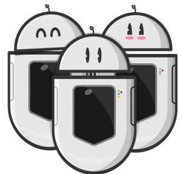

# Desafio Domo

Nossos Domos estão se multiplicando muito rápido estamos precisando de ajuda para registrá-los em nosso sistema. Para nos ajudar neste desafio precisamos criar uma API RESTful usando Django para cadastrar os Domos e alocá-los em suas respectivas tarefas.

O sistema será composto de dois recursos que relacionam entre si: Domo e Tarefa

## Domo

Os Domos são os nossos divertidos robozinhos que nos ajudam a realizar as tarefas na Configr. Um Domo deve possuir os atributos a seguir:

- Id
- Nome
- Pontos de suporte (de 1 a 5)
- Pontos de migração (de 1 a 5)
- Pontos de automação (de 1 a 5)
- Pontos de configuração (de 1 a 5)
- Pontos de monitoramento (de 1 a 5)

## Tarefa

As tarefas devem possuir os atributos a seguir:

- Id
- Titulo
- Descrição
- Área principal
- Área secundária (opcional)
- Domo encarregado

Obs. 1: As áreas das tarefas se limitam as áreas de pontuação dos Domos (suporte, migração, automação, configuração e monitoramento). 
Obs. 2: A área secundária pode ser nula mas não pode ser a mesma da primária.
Obs. 3: As tarefas podem ser criadas sem um Domo vinculado a ela.

# Solução

Clone este repositório para implementar a sua solução e ao concluir sua implementação realize um pull request para sinalizar que você terminou.

A solução será avaliada através dos critérios a seguir:

- Arquitetura coerente, consistência e código idiomático.
- Uso dos verbos RESTful corretos.
- Validação de entrada inválida.
- Presença de testes automatizados para validar sua solução.

A solução deve apresentar as funcionalidades a seguir:

- A API precisa suportar as operações de criação, atualização, listagem e recuperação de um recurso no sistema.
- Um endpoint ou filtro para sugerir os melhores Domos para realizar uma tarefa levando em conta suas habilidades e as áreas da tarefa. Um Domo que já estiver alocado em uma tarefa não pode ser sugerido. 

Crie um arquivo `comments.md` para documentar sua linha de pensamento, dificuldades, ideias e possíveis melhorias durante o seu processo de desenvolvimento.

**Atenção**: Jogo limpo, cópias de outros candidatos não serão toleradas.
